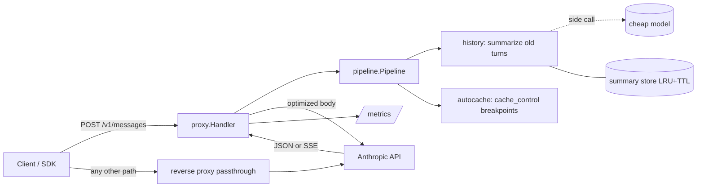

# ShortTok

A token-saving proxy for the Anthropic Messages API, written in Go with zero external dependencies.

Point your client's base URL at ShortTok instead of `api.anthropic.com`. It rewrites each request to be cheaper, forwards it (streaming included) and reports how many tokens it saved.

## Quick start

```bash
make run                       # listens on :8080
curl -i localhost:8080/v1/messages \
  -H "x-api-key: $ANTHROPIC_API_KEY" -H "content-type: application/json" \
  -d '{"model":"claude-sonnet-5","max_tokens":256,"messages":[{"role":"user","content":"Hi"}]}'
```

With the SDK: `Anthropic(base_url="http://localhost:8080")`. Responses carry `X-Shorttok-Tokens-Before` / `X-Shorttok-Tokens-After` headers; aggregate numbers are at `/metrics`.

## Architecture



```
cmd/shorttok/            entry point, wiring, graceful shutdown
internal/anthropic/      API types (unknown fields preserved) + upstream client
internal/pipeline/       Optimizer interface, fail-open chain, report
internal/optimizer/
  history/               history compression + summary store
  autocache/             automatic prompt-cache breakpoints
internal/proxy/          /v1/messages handler, SSE streaming, usage capture
internal/metrics/        minimal Prometheus exporter
internal/tokens/         offline token estimate
internal/config/         env config
```

### Design principles

- **Fail-open.** Each optimizer runs on a snapshot; if it fails, its change is rolled back and the request goes on. If the body can't be parsed, the original bytes are forwarded. The proxy must never make things worse than no proxy.
- **Transparent.** Unknown request fields and SSE bytes pass through untouched; other endpoints are reverse-proxied as is.
- **Honest accounting.** Tokens spent by optimizers themselves (summaries) are tracked separately, so net savings = saved − spent.

### History compression

When a conversation is long enough, the oldest messages are replaced with a summary from a cheap model, appended to the system prompt; the last `KEEP_LAST` messages stay verbatim.

- The cut point is aligned to `CHUNK` messages and never splits a `tool_use` / `tool_result` pair.
- Summaries are keyed by a SHA-256 hash chain over the message prefix (seeded per API key) and built incrementally: new summary = previous summary + only the new messages.
- Thanks to chunk alignment a new summary is needed only every few turns, and in between the rewritten prefix is byte-identical, so the prompt cache stays warm.

### Auto caching

Adds `cache_control` to the end of the system prompt and to the last message, unless the client already uses caching. Cache writes cost 1.25x, so disable it (`SHORTTOK_AUTOCACHE=false`) for one-shot traffic.

## Configuration

| Variable | Default | Notes |
|---|---|---|
| `SHORTTOK_LISTEN` | `:8080` | |
| `SHORTTOK_UPSTREAM` | `https://api.anthropic.com` | |
| `ANTHROPIC_API_KEY` | – | fallback if the client sends no key |
| `SHORTTOK_AUTOCACHE` | `true` | |
| `SHORTTOK_HISTORY` | `true` | |
| `SHORTTOK_HISTORY_MODEL` | `claude-haiku-4-5-20251001` | summary model |
| `SHORTTOK_HISTORY_KEEP_LAST` | `6` | messages kept verbatim |
| `SHORTTOK_HISTORY_CHUNK` | `8` | cut-point alignment |
| `SHORTTOK_HISTORY_MIN_MESSAGES` | `12` | |
| `SHORTTOK_HISTORY_MIN_TOKENS` | `2000` | estimated size of the old part |
| `SHORTTOK_HISTORY_MAX_SUMMARY_TOKENS` | `1024` | |
| `SHORTTOK_HISTORY_CACHE_SIZE` / `_TTL` | `10000` / `24h` | |

## Metrics

`shorttok_requests_total{code}`, `shorttok_estimated_tokens_{before,after}_total`, `shorttok_{input,output}_tokens_total`, `shorttok_cache_{read,write}_tokens_total`, `shorttok_aux_{input,output}_tokens_total`, `shorttok_optimizer_errors_total{optimizer}`, `shorttok_upstream_errors_total`.

## Roadmap

1. **Measure honestly**: exact counts via `/v1/messages/count_tokens`; an eval harness that replays a dataset with and without optimizers and scores answer quality with an LLM judge.
2. **More optimizers**: trimming (whitespace, duplicated pasted blocks, huge logs/JSON), tool-result truncation.
3. **Scale**: Redis summary store, per-key config, rate limits.
4. **Observability**: docker-compose with Prometheus + Grafana dashboard, latency histograms, OpenTelemetry traces.
5. **Beyond**: OpenAI-compatible endpoint, semantic cache (embeddings + pgvector), model routing.
