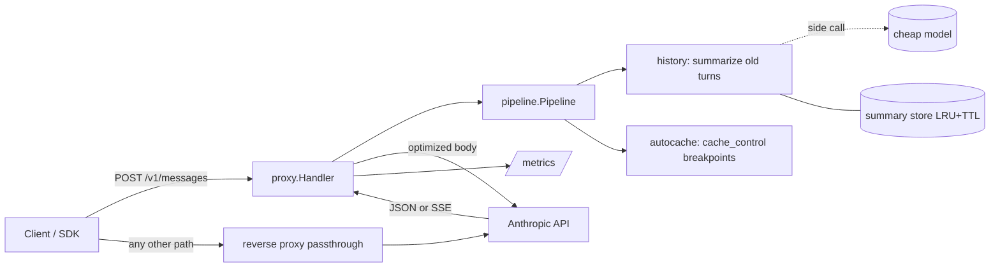

# ShortTok

A token-saving proxy for the Anthropic Messages API, written in Go with zero external dependencies.

Point your client's base URL at ShortTok instead of `api.anthropic.com`. It rewrites each request to be cheaper, forwards it (streaming included) and reports how many tokens it saved.

## Quick start

```bash
make run                       # listens on :8080
curl -i localhost:8080/v1/messages \
  -H "x-api-key: $ANTHROPIC_API_KEY" -H "content-type: application/json" \
  -d '{"model":"claude-sonnet-5","max_tokens":256,"messages":[{"role":"user","content":"Hi"}]}'
```

With the SDK: `Anthropic(base_url="http://localhost:8080")`. Responses carry `X-Shorttok-Tokens-Before` / `X-Shorttok-Tokens-After` headers; aggregate numbers are at `/metrics`.

## Architecture



```
cmd/shorttok/            entry point, wiring, graceful shutdown
internal/anthropic/      API types (unknown fields preserved) + upstream client
internal/pipeline/       Optimizer interface, fail-open chain, report
internal/optimizer/
  history/               history compression + summary store
  autocache/             automatic prompt-cache breakpoints
internal/proxy/          /v1/messages handler, SSE streaming, usage capture
internal/metrics/        minimal Prometheus exporter
internal/tokens/         offline token estimate
internal/pricing/        USD prices and cost math
internal/eval/           eval harness: dataset, generator, runner, judge, report
internal/config/         env config
cmd/shorttok-eval/       eval CLI
deploy/                  Prometheus, Grafana provisioning + dashboard, pricing.json
docker-compose.yml       local observability stack
```

### Design principles

- **Fail-open.** Each optimizer runs on a snapshot; if it fails, its change is rolled back and the request goes on. If the body can't be parsed, the original bytes are forwarded. The proxy must never make things worse than no proxy.
- **Transparent.** Unknown request fields and SSE bytes pass through untouched; other endpoints are reverse-proxied as is.
- **Honest accounting.** Tokens spent by optimizers themselves (summaries) are tracked separately, so net savings = saved − spent.

### History compression

When a conversation is long enough, the oldest messages are replaced with a summary from a cheap model, appended to the system prompt; the last `KEEP_LAST` messages stay verbatim.

- The cut point is aligned to `CHUNK` messages and never splits a `tool_use` / `tool_result` pair.
- Summaries are keyed by a SHA-256 hash chain over the message prefix (seeded per API key) and built incrementally: new summary = previous summary + only the new messages.
- Thanks to chunk alignment a new summary is needed only every few turns, and in between the rewritten prefix is byte-identical, so the prompt cache stays warm.

### Auto caching

Adds `cache_control` to the end of the system prompt and to the last message, unless the client already uses caching. Cache writes cost 1.25x, so disable it (`SHORTTOK_AUTOCACHE=false`) for one-shot traffic.

## Configuration

| Variable | Default | Notes |
|---|---|---|
| `SHORTTOK_LISTEN` | `:8080` | |
| `SHORTTOK_UPSTREAM` | `https://api.anthropic.com` | |
| `ANTHROPIC_API_KEY` | – | fallback if the client sends no key |
| `SHORTTOK_AUTOCACHE` | `true` | |
| `SHORTTOK_HISTORY` | `true` | |
| `SHORTTOK_HISTORY_MODEL` | `claude-haiku-4-5-20251001` | summary model |
| `SHORTTOK_HISTORY_KEEP_LAST` | `6` | messages kept verbatim |
| `SHORTTOK_HISTORY_CHUNK` | `8` | cut-point alignment |
| `SHORTTOK_HISTORY_MIN_MESSAGES` | `12` | |
| `SHORTTOK_HISTORY_MIN_TOKENS` | `2000` | estimated size of the old part |
| `SHORTTOK_HISTORY_MAX_SUMMARY_TOKENS` | `1024` | |
| `SHORTTOK_HISTORY_CACHE_SIZE` / `_TTL` | `10000` / `24h` | |
| `SHORTTOK_PRICING_FILE` | – | JSON prices merged over built-in defaults |

Send `X-Shorttok-Bypass: 1` to forward a request without optimization (used by the eval harness).

## Dashboard: "saved $X"

```bash
ANTHROPIC_API_KEY=sk-ant-... make up   # ShortTok :8080, Prometheus :9090, Grafana :3000
```

Grafana opens straight into the provisioned **ShortTok** dashboard: money saved (USD and %), actual spend, spend on summaries, cache hit ratio, cost per hour with vs without the proxy, tokens, savings by model, status codes and errors.

**How savings are computed.** For each request the proxy knows the exact billed usage and the compression ratio of its shrinking steps. The baseline is billed input × ratio, priced at full input rate if the proxy added the cache breakpoints itself, or with the client's own caching pattern if the client manages caching. Saved = baseline − actual input − summary spend. Output cost is identical in both cases and excluded.

**Prices** live in `deploy/pricing.json` (USD per 1M tokens, longest model-name prefix wins). Add new models from the [official pricing page](https://www.anthropic.com/pricing); requests for models without a price show up as `shorttok_unpriced_requests_total`.

### Metrics

`shorttok_cost_microusd_total{kind,model}` with kind = baseline | input | output | aux, `shorttok_baseline_input_tokens_total`, `shorttok_requests_total{code}`, `shorttok_estimated_tokens_{before,after}_total`, `shorttok_{input,output}_tokens_total`, `shorttok_cache_{read,write}_tokens_total`, `shorttok_aux_{input,output}_tokens_total`, `shorttok_optimizer_errors_total{optimizer}`, `shorttok_unpriced_requests_total{model}`, `shorttok_upstream_errors_total`.

## Eval: does it save money without hurting answers?

`shorttok-eval` sends every conversation through the proxy twice, as a baseline (bypass) and optimized, and compares:

- **cost**, including the summaries the proxy paid for (reported via `X-Shorttok-Aux-Cost-Microusd`);
- **fact recall**: share of known facts the final answer mentions, deterministic;
- **LLM judge** score 1–5 of the optimized answer against the baseline answer.

With `-replay` (default) each conversation is replayed turn by turn like a real chat (intermediate turns use `max_tokens: 1`), so prompt caching and incremental summaries behave as in production.

```bash
make eval-gen                                  # 20 synthetic "needle" conversations
SHORTTOK_HISTORY_MIN_TOKENS=300 make up        # synthetic chats are short: lower the threshold
ANTHROPIC_API_KEY=sk-ant-... make eval         # writes eval-report.md
```

The generator states facts (region, database, budget, deadline, team lead) in the first turns, adds unrelated filler turns, and asks to recall them at the end, so the facts land exactly in the summarized part. It is a smoke test of the mechanics; for real numbers, export conversations from your application logs into the same JSONL format (`id`, `model`, `max_tokens`, `system`, `messages`, optional `expect`).

## Roadmap

1. **Measure precisely**: exact counts via `/v1/messages/count_tokens` instead of the byte estimate; judge in both orders to remove position bias; eval in CI on a small fixed dataset.
2. **More optimizers**: trimming (whitespace, duplicated pasted blocks, huge logs/JSON), tool-result truncation.
3. **Scale**: Redis summary store, per-key config, rate limits.
4. **Observability**: latency histograms, OpenTelemetry traces, alerts on optimizer errors.
5. **Beyond**: OpenAI-compatible endpoint, semantic cache (embeddings + pgvector), model routing.
